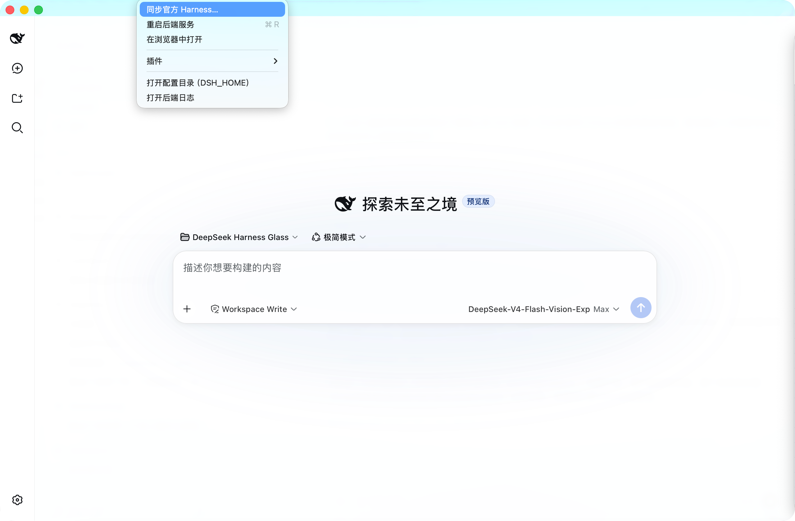
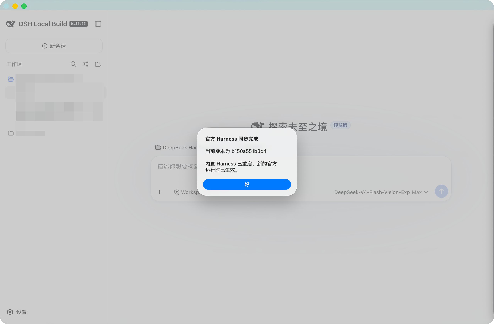

# DeepSeek Harness Glass Sync

[English](README.md) · [简体中文](README.zh.md)

A native macOS shell for [DeepSeek Harness](https://github.com/deepseek-ai/deepseek-harness) —
**the dsh you know, in a real Liquid Glass window that stays current with
official Harness.**

DeepSeek Harness Glass Sync embeds the **unmodified official DeepSeek Harness
runtime** and its Web UI in a self-contained macOS app. Instead of an Electron
or Tauri wrapper, the shell is a small SwiftUI program that puts the entire
window on Apple's public
[`glassEffect`](https://developer.apple.com/documentation/swiftui/glasseffect(_:in:))
material. The result is the same edge refraction, lensing, and layered
materials Apple's own macOS 26 apps use — not a CSS approximation.

The app does not replace Harness's plugin architecture. It launches the
official `web` profile, preserving Cordis profile bundles, `dsh plugin`
installation, user `cordis.patch.yml` layers, the official Web client module
system, and dynamic Host/Client Cordis packages.

## Origin and upstreams

This project is a substantial continuation of
[qniequn-boop/deepseek-harness-glass](https://github.com/qniequn-boop/deepseek-harness-glass),
the original native Swift Liquid Glass wrapper. It retains that project's
attribution and MIT licensing while adding a maintainable official-runtime
sync path, complete plugin management, and native reliability fixes.

It tracks the official
[deepseek-ai/deepseek-harness](https://github.com/deepseek-ai/deepseek-harness)
source as the `upstream/deepseek-harness` Git submodule. The outer Swift shell
is intentionally separate from that submodule: updating official Harness does
not require forking or rewriting its Web UI, Cordis architecture, or plugin
API.

## Requirements

- macOS 26 or later (Liquid Glass is a Tahoe-era API)
- Apple Silicon (arm64)

## Installation

Download `DeepSeek Harness Glass Sync-<version>.dmg` from this repository's
**Releases** page, open it, and drag the app into **Applications**.

The build is ad-hoc signed and not notarized. On first launch, macOS shows an
"unidentified developer" prompt: **right-click the app → Open**, then confirm.
This is required once.

On first run, open **Settings** in the app and enter your own DeepSeek API
key. The app stores its data in `~/.dsh`, the same home directory the dsh CLI
uses, so existing sessions, profiles, and `cordis.patch.yml` patches are
picked up automatically.

## Features

- **Real Liquid Glass** — the window background is the native `glassEffect`
  material. Edge optics, corner treatment, and refraction are rendered by the
  system, identically to first-party macOS 26 applications.
- **Full-window glass** — the glass extends into the title bar area
  (`fullSizeContentView` + a zero-safe-area hosting view), so there is no
  unglazed strip at the top.
- **Official full runtime** — the app packages the official Harness source
  checkout's deployed `@deepseek-ai/dsh` closure, including every shipped
  profile bundle and Web plugin. It is not a reduced Web-only payload.
- **Self-contained plugin management** — fixed Node.js and pnpm versions are
  bundled. The native **Harness → Plugins** menu calls the official
  `dsh plugin --profile web` command with those embedded tools; no system
  Node or pnpm is required.
- **Official in-app sync** — **Harness → Sync Official Harness…** resolves the
  latest official GitHub commit, downloads that exact source revision, builds
  it with the bundled Node.js/pnpm, and atomically activates a versioned
  runtime. A failed build leaves the previous runtime untouched.
- **Fullscreen-safe restart** — a sync-triggered backend restart restores the
  prior maximized or native full-screen presentation and forces the rebuilt
  WebView to fill its content area again.
- **Native editing shortcuts** — standard macOS actions including
  ⌘Z/⇧⌘Z, ⌘X, ⌘C, ⌘V, ⌘A, and Find are delivered through AppKit's responder
  chain to the focused Harness editor.
- **Readable in both themes** — the glass layer keeps explicit light and dark
  foreground/background tokens so wallpaper luminance cannot make the
  official UI unreadable.
- **Shared harness state** — `DSH_HOME` defaults to `~/.dsh`; credentials,
  sessions, settings, Profile Bundles, and installed plugins are identical to
  the CLI.
  An explicit `DSH_HOME` environment variable overrides it.
- **Dynamic text contrast** — the shell samples the desktop wallpaper's
  average luminance at launch and on wallpaper change, and chooses a light or
  dark text palette with hysteresis. Dragging the window never flips the
  colors (Apple's own guidance: large surfaces should not flip).
- **Layered frosting** — the composer, popovers, menus, and hover cards carry
  per-layer translucent tints and a `backdrop-filter` sweep, so elevated
  surfaces read as glass stacked on glass.
- **Smart port reuse** — if a dsh instance is already running on
  127.0.0.1:3080, the shell attaches to it instead of spawning a duplicate.
- **Crash recovery** — the embedded backend restarts once automatically;
  a second consecutive failure shows a retry page with the log path.
- **Tray-resident** — closing the window hides it; the menu-bar item keeps
  show / restart / open-in-browser / open-home / quit actions available.
- **Clean lifecycle** — quitting, closing the window, or killing the process
  all terminate the embedded backend; no orphan processes.

## Plugin compatibility

Glass starts the official `web` profile rather than a parallel plugin system.
That means these official extension paths remain available:

- **Profile Bundles:** use **Harness → Plugins → Install Plugin Package…**,
  or run `dsh plugin --profile web add <package>` from a compatible CLI. The
  package is installed into `$DSH_HOME/profiles/web` and is composed by the
  official profile loader on the next backend start.
- **User patch layers:** `$DSH_HOME/profiles/web/cordis.patch.yml` and
  `$DSH_HOME/cordis.patch.yml` apply with the same precedence as official dsh.
- **Dynamic Cordis packages:** the official Web API, `/plugins` module loader,
  `dsh-cordis-host-runner`, and `dsh-cordis-client-runner` remain in place.
  Host and browser halves therefore use the official approval and lifecycle
  flow.

If Glass attached to an external dsh instance on port 3080, install/remove
still updates the correct profile, but restart that external instance yourself.

### Companion Task Board plugin

[dsh-task-board](https://github.com/etony668/dsh-task-board) is a separate,
open-source DeepSeek Harness plugin for visual project task boards. It is not
vendored into this repository and is **not** part of the official Harness sync
flow. Install, update, and report issues for it in its own repository; this
keeps the app's runtime synchronization independent of plugin release cadence.

## How it works

```
DeepSeek Harness.app
└── Contents/
    ├── MacOS/DeepSeek Harness        ← Swift shell (glass/Sources/main.swift)
    └── Resources/
        ├── node/node                 ← bundled Node.js v24 (official binary)
        ├── pnpm/                     ← bundled fixed pnpm package
        ├── bin/pnpm                  ← wrapper that always uses bundled Node
        └── backend/                  ← `pnpm deploy` output for official dsh
```

1. The shell spawns the bundled Node:
   `node --expose-internals …/backend/lib/bin.js web --no-open --port 0`
   (`--expose-internals` is required by the dsh web profile's HMR service).
2. It parses the `dsh web: http://127.0.0.1:<port>` line from stdout and loads
   that URL into a transparent `WKWebView`. The port is ephemeral and bound to
   loopback only; nothing is exposed to the network.
3. A `WKUserScript` injects `GLASS_CSS`, which re-tints the dsh design tokens
   (`--dsw-alias-*`) — the frontend's own theming extension point — so the
   whole UI becomes translucent without touching dsh source.
4. The native glass material sits behind the transparent web content.

## Building from source

Clone with the official Harness submodule:

```sh
git clone --recurse-submodules https://github.com/etony668/deepseek-harness-glass-sync.git
cd deepseek-harness-glass-sync

# Downloads the fixed Node/pnpm versions, installs and builds the official
# Harness source, deploys its full production runtime, then smoke-tests `dsh web`.
./scripts/build-runtime.sh

# Package the native shell.
cd glass && ./assemble.sh
```

The app is written to `/Applications/DeepSeek Harness.app` by default.
Set `APP_PATH` to build elsewhere:

```sh
APP_PATH="$PWD/dist/DeepSeek Harness.app" ./assemble.sh
```

Create the installer image:

```sh
mkdir -p dmg-stage && cp -R "/Applications/DeepSeek Harness.app" dmg-stage/
ln -s /Applications dmg-stage/Applications
hdiutil create -volname "DeepSeek Harness Glass Sync" -srcfolder dmg-stage \
  -ov -format UDZO "dist/DeepSeek Harness Glass Sync-0.6.0.dmg"
```

A `v*` tag pushed to GitHub triggers `.github/workflows/release.yml`, which
performs all of the above and attaches the DMG to a Release.

## Updating official Harness

The official product page at [deepseek.com/harness](https://www.deepseek.com/harness/)
is the product and usage entry point. It does not expose a stable version feed for
the source tree, so the in-app **Harness → Sync Official Harness…** action uses the
official [deepseek-ai/deepseek-harness](https://github.com/deepseek-ai/deepseek-harness)
repository instead: it reads the latest `master` commit through GitHub's API,
downloads that exact commit, builds it with the app's bundled Node.js/pnpm, and
atomically activates the result.

Choose **Harness → Sync Official Harness…** from the native macOS menu:



When the replacement runtime has been activated and the embedded backend has
restarted, Glass confirms the exact official commit now in use:



The `upstream/deepseek-harness` Git submodule is the exact official source
revision the release is built from. Its current checked-in revision is visible
with:

```sh
git submodule status
```

To advance to the current official `master`, then rebuild:

```sh
./scripts/sync-upstream.sh
./scripts/build-runtime.sh
cd glass && ./assemble.sh
```

Review and commit the resulting submodule pointer in the Glass repository.
The Swift shell remains outside the submodule, so ordinary official changes
rarely conflict with the native UI work. For a reproducible historical build,
do not run the sync script: use the committed submodule revision.

In-app synchronization stores versioned runtimes under
`~/Library/Application Support/DeepSeek Harness Glass/runtime/`; it never rewrites
the signed app bundle or `$DSH_HOME`, so credentials, sessions, and installed
plugins remain untouched. If a download or build fails, the previous active
runtime remains in place.

## Troubleshooting

**"DeepSeek Harness 启动失败（code 1）"** — the bundled official runtime may
be incomplete. Rebuild it from the locked official source:

```sh
cd glass && ./repair-backend.sh
```

This rebuilds the complete official runtime, smoke-tests the official Web
profile, and repackages the app.

**App and CLI cannot run at the same time** — both use `~/.dsh`. Point the
app at a different `DSH_HOME` if you need both.

## Project layout

```
glass/
  Sources/main.swift     native shell + official plugin-management menu
  assemble.sh            build + ad-hoc sign + atomic replace
  repair-backend.sh      rebuild official runtime + repackage
  runtime/versions.env   fixed embedded Node/pnpm versions
  Info.plist             bundle metadata (LSMinimumSystemVersion 26.0)
scripts/
  sync-upstream.sh       advance official Harness submodule to origin/master
  build-runtime.sh       build/deploy/smoke-test the full official runtime
upstream/deepseek-harness/
  ...                    pinned official source Git submodule
build/icon.icns          app icon, derived from the dsh whale favicon
```

## Design notes

The window is `isOpaque = false` with a clear background so the glass material
can refract the desktop behind it. Web content deliberately cannot sample
what is behind a window (a platform privacy boundary), so the elevated
surfaces use layered tints plus `backdrop-filter` over the page's own content
rather than a second native blur pass. Text tokens are kept solid to avoid
backdrop color bleeding through glyphs, with a 0.5% white underlay and
antialiased font smoothing.

## Disclaimer

This is an independent, unofficial continuation of
[deepseek-harness-glass](https://github.com/qniequn-boop/deepseek-harness-glass)
and wrapper around the open-source
[DeepSeek Harness](https://github.com/deepseek-ai/deepseek-harness) project.
It is not affiliated with or endorsed by DeepSeek, the original Glass project
author, or their respective organizations. "DeepSeek" and related marks belong
to their respective owners.

## License

MIT — see [LICENSE](LICENSE). Bundled components are covered separately in
[THIRD_PARTY_NOTICES.md](THIRD_PARTY_NOTICES.md).
