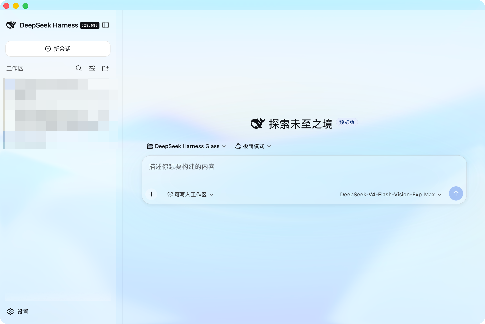
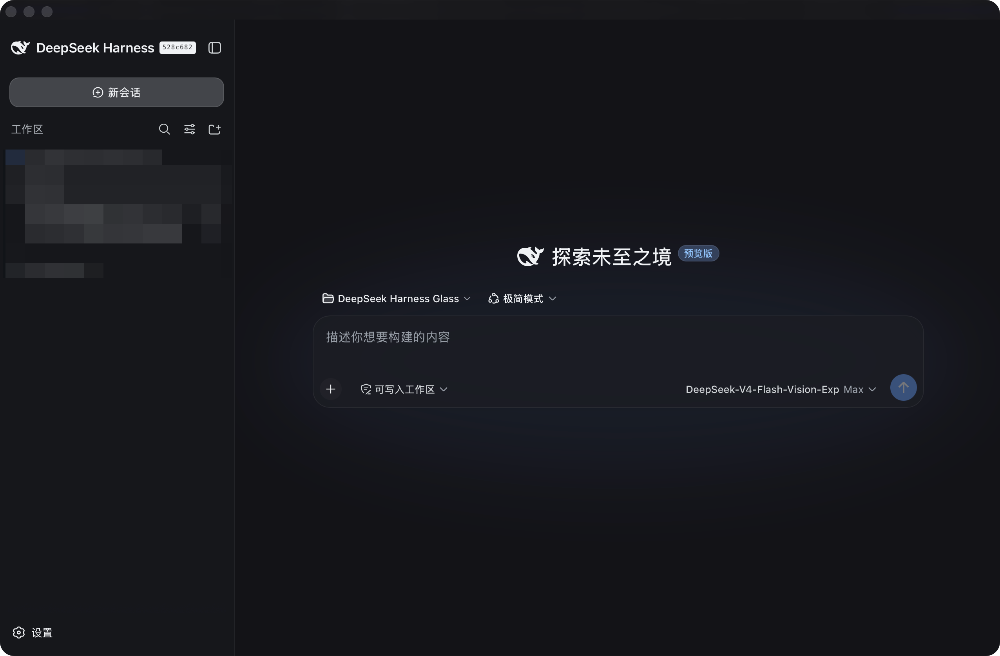

# DeepSeek Harness Glass Sync

[English](README.md) · [简体中文](README.zh.md)





> **系统支持：** Apple 芯片（arm64）的 macOS 26 或更高版本，以及 Windows 10
> 2004（19041）或更高版本（x64/ARM64）。Windows 11 额外提供原生
> Mica/Acrylic 毛玻璃材质。

[DeepSeek Harness](https://github.com/deepseek-ai/deepseek-harness) 的原生
macOS 与 Windows 外壳——**你熟悉的 dsh，装进真正的系统材质窗口，并能持续同步官方
Harness。**

DeepSeek Harness Glass Sync 将**未经修改的官方 DeepSeek Harness 运行时**及其 Web
界面封装进自包含的桌面应用。macOS 外壳是精简的 SwiftUI 程序，直接使用苹果公开的
[`glassEffect`](https://developer.apple.com/documentation/swiftui/glasseffect(_:in:))
材质；Windows 外壳采用 WinUI 3 + WebView2，在 Windows 11 使用 Mica 与 Acrylic
原生材质。两者都不是 Electron / Tauri 包装。

本项目不会重写 Harness 的插件架构。App 直接启动官方 `web` profile，完整保留
Cordis Profile Bundle、`dsh plugin` 安装、用户 `cordis.patch.yml` 层、官方 Web
客户端模块系统和动态 Host/Client Cordis 插件。

## 来源与上游

本项目是在
[qniequn-boop/deepseek-harness-glass](https://github.com/qniequn-boop/deepseek-harness-glass)
之上进行的实质性改造与延续。原项目提供了原生 Swift 液态玻璃外壳；本项目保留其
署名与 MIT 许可，并增加了可维护的官方运行时同步、完整插件管理和原生稳定性修复。

官方
[deepseek-ai/deepseek-harness](https://github.com/deepseek-ai/deepseek-harness)
源码通过 `upstream/deepseek-harness` Git submodule 跟踪。Swift 外壳始终位于该
submodule 外：更新官方 Harness 时无需 fork 或重写官方 Web UI、Cordis 架构或插件
API。

## 系统要求

- **macOS：** macOS 26 或更高、Apple 芯片（arm64）；macOS 外壳使用 Tahoe
  时代的 Liquid Glass API。
- **Windows：** 推荐 Windows 11，以获得原生 Mica/Acrylic 毛玻璃效果。Windows 10
  2004（19041）或更高也可运行，会自动回退为实色系统背景；支持 x64 与 ARM64
  源码构建。

## 安装

### macOS

从本仓库的 **Releases** 下载 `DeepSeek Harness Glass Sync-<版本>.dmg`，打开后把
应用拖进「应用程序」。

当前构建为 ad-hoc 签名、未公证。首次打开时 macOS 会提示「无法验证开发者」：
**右键点击应用 → 打开**，再确认一次即可（仅需一次）。

### Windows

如果希望正常安装，请从 **Releases** 下载
`DeepSeekHarnessGlass-win-x64-<版本>.msi` 并运行。安装器会把完整应用安装到
`%LOCALAPPDATA%\Programs\DeepSeek Harness Glass`，并创建开始菜单快捷方式；
卸载时不会删除 `~/.dsh` 中的用户数据。当前 MSI 为未签名的社区构建，Windows
可能显示 SmartScreen 提示。

从 **Releases** 下载并解压 `DeepSeekHarnessGlass-win-x64-<版本>.zip`，保持整个
解压后的文件夹完整，再启动 `DeepSeekHarnessGlass.exe`。该版本是未 MSIX 签名的
便携式社区构建，Windows 可能显示 SmartScreen 提示。压缩包内也提供
`Launch-DeepSeekHarnessGlass.cmd`，可用它启动，避免误把 exe 单独移出文件夹。

压缩包已随附原生 Visual C++ runtime。Windows 仍需安装 Microsoft Edge
WebView2 Evergreen Runtime；如果首次启动提示缺少 WebView2，安装一次后重新打开
应用即可。

首次运行后在应用内的「设置」中填入你自己的 DeepSeek API Key。应用数据存放于
`~/.dsh`——与 dsh 命令行版共用同一目录，已有的会话、profile 和
`cordis.patch.yml` 补丁会自动生效。

## 特性

- **真·液态玻璃** — 窗口背景是原生 `glassEffect` 材质，边缘光学、圆角处理、
  折射全部由系统渲染，与 macOS 26 自带应用同款。
- **全窗玻璃** — 玻璃延伸到标题栏区域（`fullSizeContentView` + 零安全区宿主
  视图），顶部没有"无玻璃"的条带。
- **Windows 原生毛玻璃** — Windows 外壳使用 WinUI 3 + WebView2。主窗口使用
  Windows 11 的 Mica 系统背景，同步/启动状态层使用 Acrylic；系统不支持时自动
  回退为实色。
- **完整官方运行时** — App 打包的是官方 Harness 源码构建并 deploy 的
  `@deepseek-ai/dsh` 完整依赖闭包，包含全部官方 profile bundle 和 Web 插件，
  不是简化的「只显示网页」payload。
- **自带插件管理** — 内置固定版本 Node.js 和 pnpm。「Harness → 插件」菜单会用
  它们调用官方 `dsh plugin --profile web`；无需用户另外安装 Node 或 pnpm。
- **App 内官方同步** — 「Harness → 同步官方 Harness…」会解析官方 GitHub 最新提交，
  下载该精确源码版本，以 App 内置 Node.js/pnpm 构建，并原子激活一个版本化运行时；
  构建失败时原先的可用运行时不会被破坏。
- **全屏安全重启** — 同步触发后端重启后，App 会恢复此前的最大化或 macOS 原生全屏
  状态，并让重建后的 WebView 重新铺满内容区域。
- **原生编辑快捷键** — macOS 上 ⌘Z/⇧⌘Z、⌘X、⌘C、⌘V、⌘A 和查找会经由 AppKit
  responder chain 正确交给当前聚焦的 Harness 编辑器；Windows 上 WebView2
  直接接收标准 Ctrl 编辑快捷键。
- **深浅色均可读** — 玻璃层为浅色和深色主题显式设置前景/背景令牌，壁纸亮度不会再让
  官方 UI 的文字失去可读性。
- **与 CLI 共享状态** — `DSH_HOME` 默认 `~/.dsh`：凭据、会话、设置、已安装
  Profile Bundle 与命令行版完全一致；可用 `DSH_HOME` 环境变量覆盖。
- **动态文字对比度** — 外壳在启动与更换壁纸时采样桌面壁纸平均亮度，在深/浅
  两套文字色板间带迟滞地切换；拖动窗口绝不触发翻转（苹果的设计原则：大表面
  不应随背景翻转）。
- **层级磨砂** — 输入框、弹窗、菜单、悬浮卡各有递进半透明着色与
  `backdrop-filter` 扫描，悬浮面呈现"玻璃叠玻璃"的层次。
- **智能端口复用** — 若 127.0.0.1:3080 已有 dsh 在运行，外壳直接挂接，
  不重复拉起实例。
- **崩溃自动恢复** — 内置后端意外退出自动重启一次；连续两次失败显示带
  日志路径的重试页。
- **托盘常驻** — 关闭窗口只是隐藏；菜单栏图标提供 显示/重启服务/浏览器
  打开/打开配置目录/打开日志/退出 全套操作。
- **干净的生命周期** — 退出、关窗或被 kill 都会先终止内置后端，不留孤儿进程。

## 插件兼容性

Glass 启动的是官方 `web` profile，而不是另起一套插件系统。因此官方的三条扩展
路径都会保留：

- **Profile Bundle：** 使用「Harness → 插件 → 安装插件包…」，或在兼容 CLI 中运行
  `dsh plugin --profile web add <package>`。包会安装到
  `$DSH_HOME/profiles/web`，在下次后端启动时由官方 Profile Loader 组合。
- **用户 Patch 层：** `$DSH_HOME/profiles/web/cordis.patch.yml` 与
  `$DSH_HOME/cordis.patch.yml` 按官方 dsh 完全相同的优先级生效。
- **动态 Cordis Package：** 官方 Web API、`/plugins` 模块加载器、
  `dsh-cordis-host-runner` 与 `dsh-cordis-client-runner` 都保留，Host/浏览器两半
  仍使用官方的审批和生命周期流程。

若 Glass 挂接的是 3080 端口上的外部 dsh 实例，安装/移除仍会更新正确的 Profile，
但需要你自行重启该外部实例来加载更新后的 Bundle。

### 配套的 Task Board 插件

[dsh-task-board](https://github.com/etony668/dsh-task-board) 是一个独立开源的
DeepSeek Harness 可视化项目任务看板插件。它不会被 vendoring 到本仓库，也**不属于**
官方 Harness 的同步范围；请在其独立仓库安装、更新和反馈问题。这样 App 的官方运行时
同步与插件自身的发布节奏保持解耦。

## 工作原理

```
DeepSeek Harness.app
└── Contents/
    ├── MacOS/DeepSeek Harness        ← Swift 外壳（glass/Sources/main.swift）
    └── Resources/
        ├── node/node                 ← 内置 Node.js v24（官方二进制）
        ├── pnpm/                     ← 内置固定版本 pnpm 包
        ├── bin/pnpm                  ← 永远使用内置 Node 的 pnpm 包装器
        └── backend/                  ← `pnpm deploy` 的官方 dsh 产物
```

1. 外壳用内置 Node 启动后端：
   `node --expose-internals …/backend/lib/bin.js web --no-open --port 0`
   （`--expose-internals` 是 dsh web profile 中 HMR 服务的要求）。
2. 解析 stdout 里的 `dsh web: http://127.0.0.1:<端口>`，用透明 `WKWebView`
   加载。端口随机、只绑回环地址，不对外暴露。
3. `WKUserScript` 注入 `GLASS_CSS`，重染 dsh 的设计令牌（`--dsw-alias-*`，
   前端自带的主题扩展点），整界面半透明化，dsh 源码零改动。
4. 原生玻璃材质位于透明网页内容之下。

## 从源码构建

请用官方 Harness submodule 克隆：

```sh
git clone --recurse-submodules https://github.com/etony668/deepseek-harness-glass-sync.git
cd deepseek-harness-glass-sync
```

### macOS

```sh

# 下载固定 Node/pnpm，构建官方 Harness 源码，deploy 完整生产运行时，
# 并对官方 `dsh web` profile 做冒烟验证。
./scripts/build-runtime.sh

# 打包原生外壳
cd glass && ./assemble.sh
```

应用默认输出到 `/Applications/DeepSeek Harness.app`；用 `APP_PATH` 指定别处：

```sh
APP_PATH="$PWD/dist/DeepSeek Harness.app" ./assemble.sh
```

制作安装镜像：

```sh
mkdir -p dmg-stage && cp -R "/Applications/DeepSeek Harness.app" dmg-stage/
ln -s /Applications dmg-stage/Applications
hdiutil create -volname "DeepSeek Harness Glass Sync" -srcfolder dmg-stage \
  -ov -format UDZO "dist/DeepSeek Harness Glass Sync-0.5.9.dmg"
```

推送 `v*` 标签会触发 `.github/workflows/release.yml`，自动完成以上全部步骤，
并把 macOS DMG、Windows x64 ZIP 与 Windows x64 MSI 一起挂到 Release。

### Windows

请在安装了 .NET 8 SDK 与 Git 的 Windows 机器上构建。脚本会自行下载固定版本的
Windows Node.js/pnpm，不要求系统已安装 Node.js 或 pnpm。

```powershell
git clone --recurse-submodules https://github.com/etony668/deepseek-harness-glass-sync.git
cd deepseek-harness-glass-sync

# 只为当前 PowerShell 会话允许运行仓库中的构建脚本。
Set-ExecutionPolicy -Scope Process -ExecutionPolicy Bypass

# 构建官方 Harness runtime、冒烟验证、发布自包含 WinUI 3 外壳，
# 并把运行时资源复制到 .exe 旁。
.\windows\package.ps1 -Architecture x64

.\windows\dist\DeepSeekHarnessGlass-win-x64\DeepSeekHarnessGlass.exe

# 发布文件夹准备好后，使用 WiX 构建 MSI 安装包。
.\windows\build-installer.ps1 -Architecture x64 -Version 0.5.9
```

Windows on ARM 请把 `x64` 改为 `arm64`。若已构建 runtime、只需要重新发布原生
外壳，可使用：

```powershell
.\windows\package.ps1 -Architecture x64 -SkipRuntimeBuild
```

Windows App 文件夹必须整体保留：`Resources\` 必须和
`DeepSeekHarnessGlass.exe` 位于同一输出目录。它运行的是同一个官方 `web` profile，
运行时更新保存在 `%LOCALAPPDATA%\DeepSeek Harness Glass\runtime\`；凭据、会话、
profile 和插件仍使用 `%USERPROFILE%\.dsh`（或显式设置的 `DSH_HOME`）。

## 同步官方 Harness

官方产品页 [deepseek.com/harness](https://www.deepseek.com/harness/) 是产品介绍和
使用入口，并没有提供稳定的源码版本接口。因此 App 中的「Harness → 同步官方
Harness…」按钮不会解析官网 HTML，而是使用官方
[deepseek-ai/deepseek-harness](https://github.com/deepseek-ai/deepseek-harness) 仓库：
通过 GitHub API 读取 `master` 最新 commit，下载该精确提交，再用 App 内置的
Node.js/pnpm 构建并原子切换运行时。

在原生菜单中选择 **Harness → 同步官方 Harness…**：


替换运行时激活且内置后端重启完成后，Glass 会明确显示当前正在使用的官方提交：


`upstream/deepseek-harness` Git submodule 是每个 Glass Release 实际构建所用的
官方源码版本。查看当前锁定提交：

```sh
git submodule status
```

将它更新至官方当前 `master`，再重建：

```sh
./scripts/sync-upstream.sh
./scripts/build-runtime.sh
cd glass && ./assemble.sh
```

审查后把更新后的 submodule 指针提交到 Glass 仓库。Swift 外壳始终位于
submodule 外，因此普通官方更新通常不会与原生 UI 改动冲突。若要可复现地构建
旧版本，请不要执行同步脚本，直接使用 Git 已锁定的 submodule 提交。

App 内同步的版本化运行时在 macOS 上保存在
`~/Library/Application Support/DeepSeek Harness Glass/runtime/`，Windows 上保存在
`%LOCALAPPDATA%\DeepSeek Harness Glass\runtime\`。它不会改写 App bundle，也不会
覆盖 `$DSH_HOME`；凭据、会话和已安装插件保持原样。下载或构建失败时，当前正在使用
的旧运行时仍会保留。

## 故障排查

**「DeepSeek Harness 启动失败（code 1）」** — 内置官方运行时可能不完整。请按锁定
的官方源码重新构建：

```sh
cd glass && ./repair-backend.sh
```

该脚本会重建完整官方运行时、冒烟测试官方 Web profile，并重新打包。

**App 与 CLI 不能同时运行** — 两者共用 `~/.dsh`。需要同时运行时给 App 设置
不同的 `DSH_HOME`。

## 项目结构

```
glass/
  Sources/main.swift     原生外壳 + 官方插件管理菜单
  assemble.sh            构建 + ad-hoc 签名 + 原子替换
  repair-backend.sh      重建官方运行时 + 重新打包
  runtime/versions.env   内置 Node/pnpm 固定版本
  Info.plist             bundle 元数据（LSMinimumSystemVersion 26.0）
windows/
  DeepSeekHarnessGlass.Windows.csproj  WinUI 3 + WebView2 原生外壳
  MainWindow.xaml(.cs)    Mica/Acrylic 界面、菜单与同步进度
  HarnessBackend.cs       官方 runtime / 插件 / 同步控制器
  build-runtime.ps1       构建并冒烟测试官方 Windows runtime
  package.ps1             发布便携式 Windows App 文件夹
  build-installer.ps1     构建 WiX MSI 安装包
  installer/Product.wxs   MSI 安装包与开始菜单快捷方式定义
  runtime/                内置 pnpm wrapper 和同步脚本
scripts/
  sync-upstream.sh       将官方 Harness submodule 前进到 origin/master
  build-runtime.sh       构建/deploy/冒烟测试完整官方运行时
upstream/deepseek-harness/
  ...                    锁定的官方源码 Git submodule
build/icon.icns          应用图标（源自 dsh 鲸鱼 favicon）
```

## 设计说明

macOS 窗口采用 `isOpaque = false` 与透明背景，Liquid Glass 材质才能折射桌面。
网页内容出于平台隐私边界无法采样窗口背后的画面，因此悬浮面采用分层着色 + 对
页面自身内容做 `backdrop-filter`，而非第二道原生模糊。Windows 则由外层 WinUI 3
窗口使用系统 Mica，原生状态层使用 Acrylic；系统不支持时自动使用实色表面。文字
令牌保持纯色，避免背景色渗入字形。

## 免责声明

本项目是
[deepseek-harness-glass](https://github.com/qniequn-boop/deepseek-harness-glass)
的独立、非官方延续，也是开源
[DeepSeek Harness](https://github.com/deepseek-ai/deepseek-harness) 的独立、
非官方外壳；与 DeepSeek、原 Glass 项目作者及其所属组织均无隶属或背书关系。
「DeepSeek」及相关标识归其权利人所有。

## 许可证

MIT — 见 [LICENSE](LICENSE)。捆绑组件的许可见
[THIRD_PARTY_NOTICES.md](THIRD_PARTY_NOTICES.md)。
